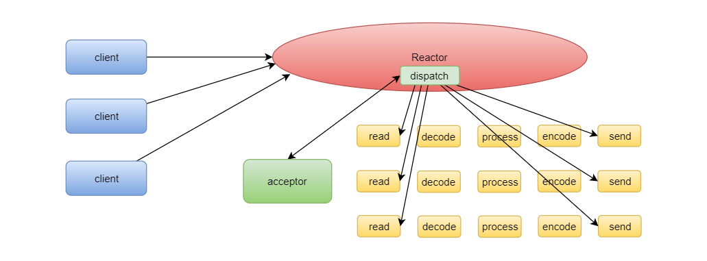
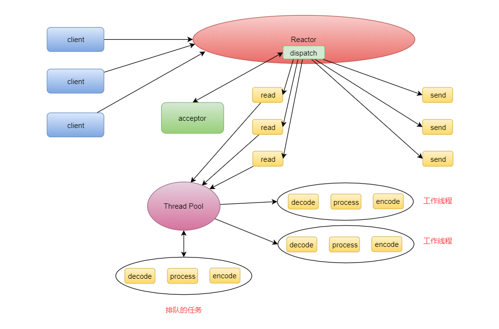
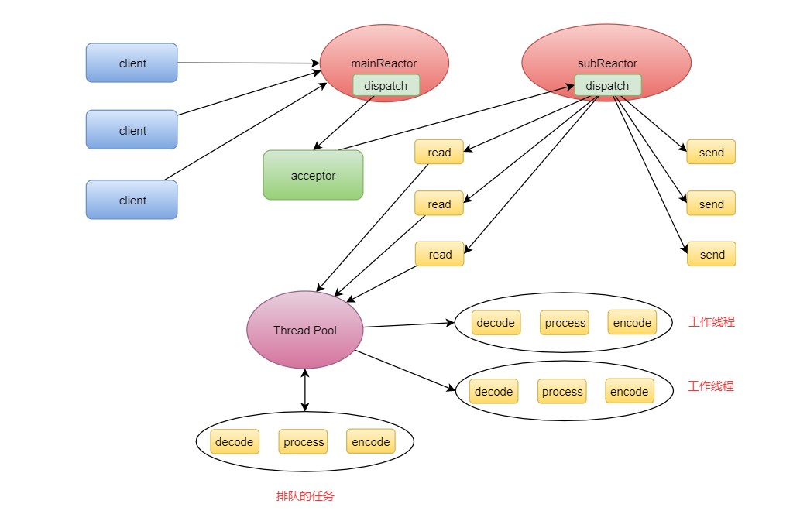
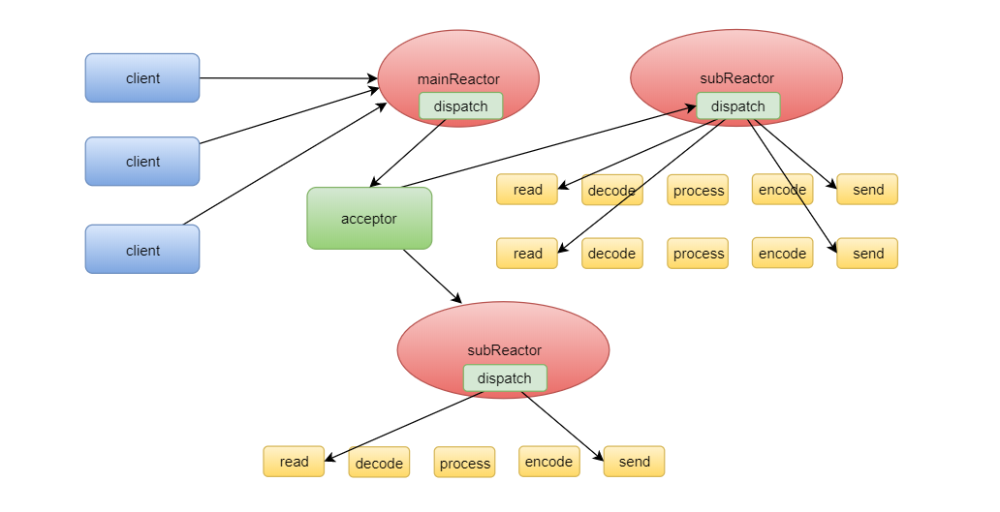

在配置EventLoopGroup 的时候,这里使用的就是Reactor 模式。
```java
 serverBootstrap.group(bossGroup, workerGroup)
 ```
#### 定义
反应器设计模式是一种事件处理模式，用于处理由一个或多个输入并发传递给服务处理程序的服务请求。
然后，服务处理程序对传入的请求进行多路分解，并将它们同步分派到相关联的请求处理程序。
可得到:
- Reactor 模式是一种事件处理模式；
- 用于处理服务请求，把它们并发地传递给一个服务处理器（service handler）；
- 有一个或多个输入源（inputs）；
- 服务处理器将这些请求以多路复用的方式分离（demultiplexes ），并把它们同步地分发到相关的请求处理器（request handlers）；

#### 网络请求的处理过程
- Read request，读取请求
- Decode request，解码请求
- Process service，处理业务
- Encode reply，编码响应


传统模式下每次来一个客户端都会启动一个新的线程来处理,每个handler都在自己的线程中
随着服务请求量越来越大，启动的线程数量会越来越多，最后，会导致服务端的线程无限增多   ，然而，其实大部分的线程可能都处于 IO 阻塞状态，并没有使用到 CPU，无法充分利用 CPU。

改进:采用基于事件驱动的设计，当有事件触发时，才调用相应的处理器来处理事件

#### Reactor 单线程模式


在服务端，对于网络请求有三种不同的事件：Accept 事件、Read 事件、Write 事件，对应于上图中的 acceptor、read、send。
> Connect 事件属于客户端事件。
为什么 acceptor（Accept 事件处理器）是双向箭头，而 read 和 send 是单向箭头呢？因为服务端启动的时候是先注册 Accept 事件到 Reactor 上，当收到客户端连接时，也就是 Accept 事件时，才会注册 Read 和 Write 事件，所以 acceptor 是双向的，Reactor 不仅要向 acceptor 分发 Accept 事件，acceptor 也要向 Reactor 注册 Read 和 Write 事件

一个 Reactor 就相当于一个事件分离器，而单线程模式下，所有客户端的所有事件都在一个线程中完成，这就出现了一个新的问题，如果哪个请求有阻塞，直接影响了所有请求的处理速度，所以，自然而然就进化出了 Reactor 的多线程模式。

#### Reactor 多线程模式


Reactor 多线程模式，还是把 IO 事件放在 Reactor 线程中来处理，同时，把业务处理逻辑放到单独的线程池中来处理，这个线程池我们称为工作线程池（Worker Thread Pool）或者业务线程池

但是，这种模式还不够完美，一个客户端连接过程需要三次握手，是一个比较耗时的操作，将 Accept 事件和 Read 事件与 Write 事件放在一个 Reactor 中来处理，明显降低了 Read 和 Write 事件的响应速度。而且，一个 Reactor 只有一个线程，也无法利用多核 CPU 的性能提升。因此，又自然而然的出现了 Reactor 主从模式。

#### Reactor 主从模式


Reactor 主从模式把 Accept 事件的处理单独拿出来放到主 Reactor 中来处理，把 Read 和 Write 事件放到子 Reactor 中来处理，而且，像这样的子 Reactor 我们可以启动多个，充分利用多核 CPU 的资源。

#### 变异的Reactor 模式


使用子 Reactor 线程池来处理业务逻辑。

#### netty使用不用的Reactor模式
**Reactor 主从模式**:有一个主 Reactor 和多个子 Reactor，但是，业务逻辑的处理还是在线程池中，
所以，在 Netty 中，需要声明两个不同的 EventLoopGroup，Handler 依然使用线程池处理。
```java
EventLoopGroup bossGroup = new NioEventLoopGroup(1); // 一个主Reactor 处理连接事件
EventLoopGroup workerGroup = new NioEventLoopGroup(); // 多个子Reactor 处理读写事件
ServerBootstrap serverBootstrap = new ServerBootstrap();
serverBootstrap.group(bossGroup, workerGroup); 
// Handler使用线程池处理
```
**Reactor 变异主从模式的使用**:
Reactor 变异主从模式，业务线程池和子 Reactor 池合并为一，
所以，在 Netty 中，Handler 放在子 Reactor 池中处理即可，默认情况，Netty 也是使用的这种模式。
```java
EventLoopGroup bossGroup = new NioEventLoopGroup(1); // 一个主Reactor
EventLoopGroup workerGroup = new NioEventLoopGroup(); // 多个子Reactor
ServerBootstrap serverBootstrap = new ServerBootstrap();
serverBootstrap.group(bossGroup, workerGroup); 
```

