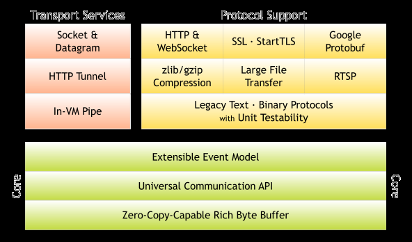
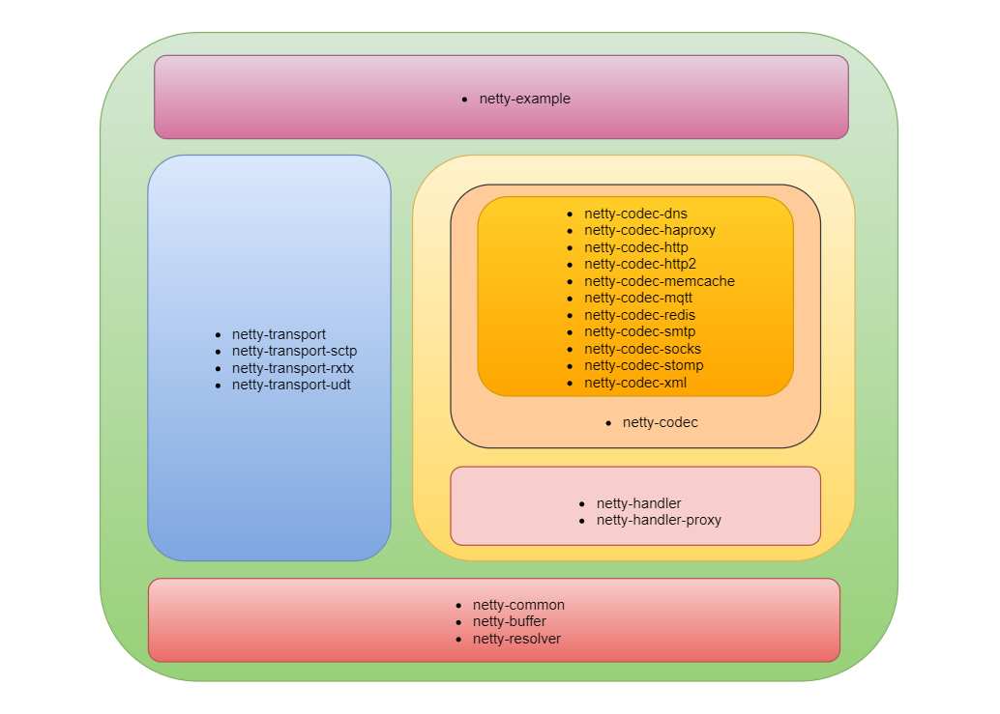

#### 架构架构

从这张架构图上，我们可以看到 Netty 的分层特别清晰：
- Core，核心层，主要定义一些基础设施，比如事件模型、通信 API、缓冲区等。
- Transport Service，传输服务层，主要定义一些通信的底层能力，或者说是传输协议的支持，比如 TCP、UDP、HTTP 隧道、虚拟机管道等。
- Protocol Support，协议支持层，这里的协议比较广泛，不仅仅指编解码协议，还可以是应用层协议的编解码，比如 HTTP、WebSocket、SSL、Protobuf、文本协议、二进制协议、压缩协议、大文件传输等，基本上主流的协议都支持。
#### 模块设计

##### netty-common:
- 通用的工具类，比如 StringUtil 等
- 对于 JDK 原生类的增强，比如 Future、FastThreadLocal 等
- Netty 自定义的并发包，比如 EventExecutor 等
- Netty 自定义的集合包，主要是对 HashMap 的增强
其他所有模块都依赖于common包
##### netty-buffer
netty自己实现的buffer,比原生的buffer好用的多,并且做了很多优化
##### netty-resolver
主要是地址解析用的

上面三个都可以看作是工具类，它们是构成整个 Netty 的基石，是底盘
##### netty-transport
netty-transport 主要定义了一些服务于传输层的接口和类，比如 Channel、ChannelHandler、ChannelHandlerContext、EventLoop 等，这些接口和类都非常的酷，它们支撑起了 Netty 的半边天。
而且，netty-transport 还实现了对于 TCP、UDP 通信协议的支持，另外三个包 netty-transport-sctp、netty-transport-rxtx、netty-transport-udt 也是对不同协议的支持，不过后两个已经废弃了，为什么呢？原因很任性，写得不好，不好用，就像废弃 Netty5.0 一样，任性！
##### netty-handler
netty-handler 中定义了各种不同的 Handler，满足不同的业务需求，这些 Handler 都是 Netty 中非常棒的功能，比如，IP 过滤、日志、SSL、空闲检测、流量整形等，有了这些 Handler，我们不仅能让我们的程序可运行，更能使我们的程序安全地运行，非常棒。
##### netty-codec
netty-codec 中定义了一系列编码解码器，比如，base64、json、marshalling、protobuf、serializaion、string、xml 等，几乎市面上能想到的编码、解码、序列化、反序列化方式，Netty 中都可以支持，它们是一类特殊的 ChannelHandler，专门负责编解码的工作