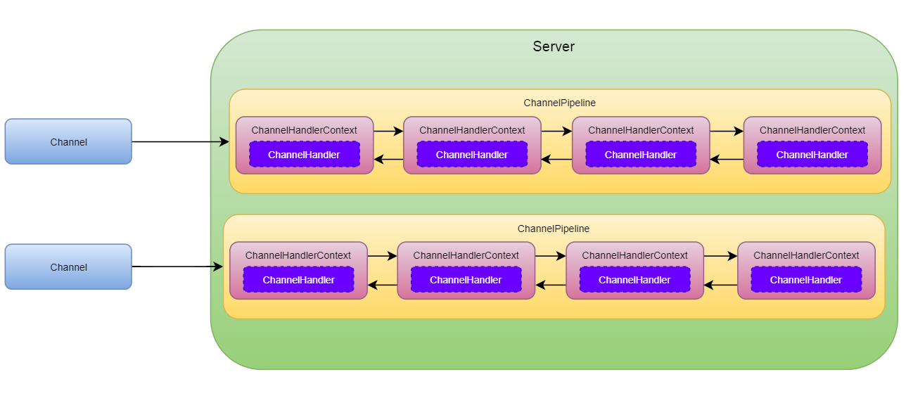

#### Bootstrap 与 ServerBootstrap
Bootstrap 与 ServerBootstrap 是 Netty 程序的引导类，主要用于配置各种参数，并启动整个 Netty 服务。它们俩都继承自 AbstractBootstrap 抽象类，不同的是，Bootstrap 用于客户端引导，而 ServerBootstrap 用于服务端引导。

#### EventLoop与EventLoopGroup
EventLoop 可以理解为是 EventLoopGroup 中的工作线程,EventLoop 本质是一个单线程执行器（同时维护了一个 Selector），里面有 run 方法处理 Channel 上源源不断的 io 事件。

EventLoop:线程+selector=>处理channel的io事件

EventLoopGroup 可以理解为一个线程池，对于服务端程序，我们一般会绑定两个线程池，一个用于处理 Accept 事件，一个用于处理读写事件。

EventLoopGroup是一组 EventLoop,Channel 一般会调用 EventLoopGroup 的 register 方法来绑定其中一个 EventLoop，后续这个 Channel 上的 io 事件都由此 EventLoop 来处理（保证了 io 事件处理时的线程安全）
#### Channel
Netty 的 Channel 是对 Java 原生 Channel 的进一步封装，不仅封装了原生 Channel 操作的复杂性，还提供了一些很酷且实用的功能，比如：
主要方法有
- close() 可以用来关闭 channel
- closeFuture() 用来处理 channel 的关闭
- sync 方法作用是同步等待 channel 关闭
- 而 addListener 方法是异步等待 channel 关闭
- pipeline() 方法添加处理器
- write() 方法将数据写入
- writeAndFlush() 方法将数据写入并刷出
#### ChannelHandler与ChannelPipeline
ChannelHandler 是核心业务处理接口，用于处理或拦截 IO 事件，并将其转发到 ChannelPipeline 中的下一个 ChannelHandler，运用的是责任链设计模式。
ChannelHandler 分为两种,一种入站,一种出战,ChannelInboundHandler 和 ChannelOutboundHandler
不过一般不建议直接实现这两个接口，而是它们的抽象类：
- SimpleChannelInboundHandler：处理入站事件，不建议直接使用 ChannelInboundHandlerAdapter
- ChannelOutboundHandlerAdapter：处理出站事件
- ChannelDuplexHandler：双向的

入站ChannelInboundHandlerAdapter是按照 addLast的顺序执行的,但是出站ChannelOutboundHandlerAdapter 是按照 addLast逆序执行
ChannelPipeline 是 ChannelHandler 的集合，它负责处理和拦截入站和出站的事件和操作，每个 Channel 都有一个 ChannelPipeline 与之对应，会自动创建。

更确切地说，ChannelPipeline 中存储的是 ChannelHandlerContext 链(双向链表)，通过这个链把 ChannelHandler 连接起来，  
#### ChannelHandlerContext
ChannelHandlerContext 保存着 Channel 的上下文，同时关联着一个 ChannelHandler，
通过 ChannelHandlerContext，ChannelHandler 方能与 ChannelPipeline 或者其它 ChannelHandler 进行交互，ChannelHandlerContext 是它们之间的纽带
#### 几者之间的关联关系
- 一个 Channel 对应一个 ChannelPipeline
- 一个 ChannelPipeline 包含一条双向的 ChannelHandlerContext 链
- 一个 ChannelHandlerContext 中包含一个 ChannelHandler(ChannelHandlerContext中行含有ChannelHandler)
- 一个 Channel 会绑定到一个 EventLoop 上
- 一个 NioEventLoop 维护了一个 Selector（使用的是 Java 原生的 Selector）
- 一个 NioEventLoop 相当于一个线程

所以,ChannelPipeline、ChannelHandlerContext 都是线程安全的，因为同一个 Channel 的事件都会在一个线程中处理完毕（假设用户不自己启动线程）
但是，ChannelHandler 却不一定，ChannelHandler 类似于 Spring MVC 中的 Service 层，专门处理业务逻辑的地方，
一个 ChannelHandler 实例可以供多个 Channel 使用，所以，不建议把有状态的变量放在 ChannelHandler 中，而是放在消息本身或者 ChannelHandlerContext 中

