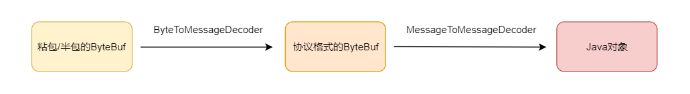

#### 粘包与半包
##### 粘包的原因:

我们知道，TCP 发送消息的时候是有缓冲区的，当消息的内容远小于缓冲区的时候，这条消息不会立马发送出去，而是跟其它的消息合并之后再发送出去，这样合并发送是明显能够提高效率的。

另一方便,接受方接受信息不及时,也会出现这个现象,所以总结为:
- 发送方发送的消息 < 缓冲区大小
- 接收方读取消息不及时
##### 半包的原因
类比粘包，如果发送的消息太大，已经超过了缓冲区的大小，这时候就必须拆分发送，也就形成了半包现象。

还有一种情况，网络协议各层是有最大负载的，所以，对应到各种协议它们是有最大发送数据的限制的，这种可以发送的最大数据称作 MTU（Maximum Transmission Unit，最大传输单元）。
总结为:
- 发送方发送的消息 > 缓冲区的大小
- 发送方发送的消息 > 协议的 MTU
##### 本质原因
**tcp是流式的,无法区分消息边界**

解决办法:
方法	如何确定消息边界	优点	缺点	推荐度
定长法	使用固定长度分割消息	简单	空间浪费	不推荐

分割符法	使用固定分割符分割消息	简单	分割符本身需要转义，且需要扫描消息的内容	不特别推荐

长度 + 内容法	先获取消息的长度，再按长度读取内容	精确获取消息的内容	需要预先知道消息的最大长度	推荐
#### 编解码
粘包 / 半包的编解码器可以说是一次编解码器，主要是对协议本身的编解码,将缓冲区中的字节数组按照协议本身的格式进行分割，其实，分割后的数据还是字节数组。
那么，分割后的字节数组如何转换成 Java 里面我们可以直接使用的对象呢？

这就需要二次解码了，通过二次解码，可以将字节数组转换成 Java 对象，然后传入我们自定义的 Handler 里面进行业务逻辑的处理。
> 一次编码器和二次编码器没有进行合并,通过分层的思想

在netty中快速区分一次编解码和二次编解码,定义了两组类来表示一次编码和二次编码:
- 一次编解码：MessageToByteEncoder/ByteToMessageDecoder ->字节
- 二次编解码：MessageToMessageEncoder/MessageToMessageDecoder ->Java对象

  
并且netty支持大部分的编码协议

